# Lab_IOP

### A. Phần giới thiệu  
 __I. Thành viên nhóm.__  
&nbsp;&nbsp;Bùi Thế Trung (Sinh viên chịu trách nhiệm chính)  
&nbsp;&nbsp;Phạm Minh Tuấn  
&nbsp;&nbsp;Phạm Quang Anh  
&nbsp;&nbsp;Nguyễn Thái Sơn  
&nbsp;&nbsp;Nguyễn Đăng Phúc Thành  
&nbsp;&nbsp;Trần Hoàng Hiệp  
  
 __II. Dự án__  
    __1. Tên đề tài:__  
&nbsp;&nbsp;- Tiếng Anh: Design and Development of an IoT-enabled Smart Agriculture Lab for Environmental Monitoring and Control using ESP32.  
&nbsp;&nbsp;- Tiếng Việt: Thiết kế và Phát triển Phòng thí nghiệm Nông nghiệp Thông minh hỗ trợ IoT để Giám sát và Kiểm soát Môi trường bằng ESP32.  
    __2. Loại đề tài:__ Nghiên cứu ứng dụng.  
    __3. Lĩnh vực khoa học:__ Khoa học tự nhiên và kỹ thuật.  
    __4. Giảng viên hướng dẫn:__ TS.Bùi Huy Kiên.  
  
### B. Quá trình gây dựng đề tài nghiên cứu  
 __1. Các trang thiết bị đóng góp cho đề tài__  
 - ESP32  
 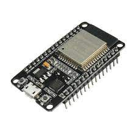](Image/image.png)
 - ESP32 Cam  
 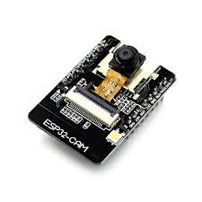](Image/image-1.png)
 - Module Relay 2 kênh 5V  
 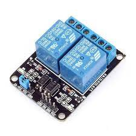](Image/image-2.png)
 - Arduino IDE  
 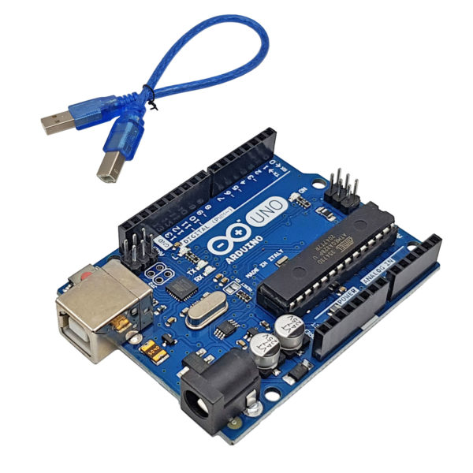](Image/image-3.png)
 - Máy bơm nước mini 3-5V  
 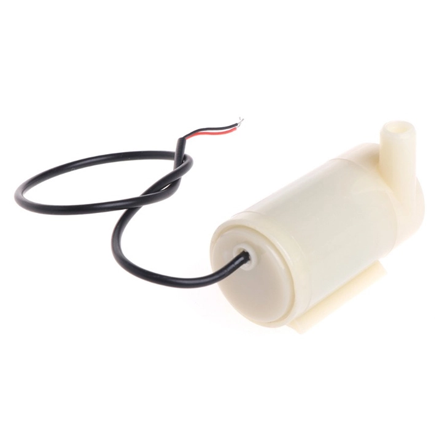](Image/image-4.png)
 - Module thời gian thực RTC Ds3231  
 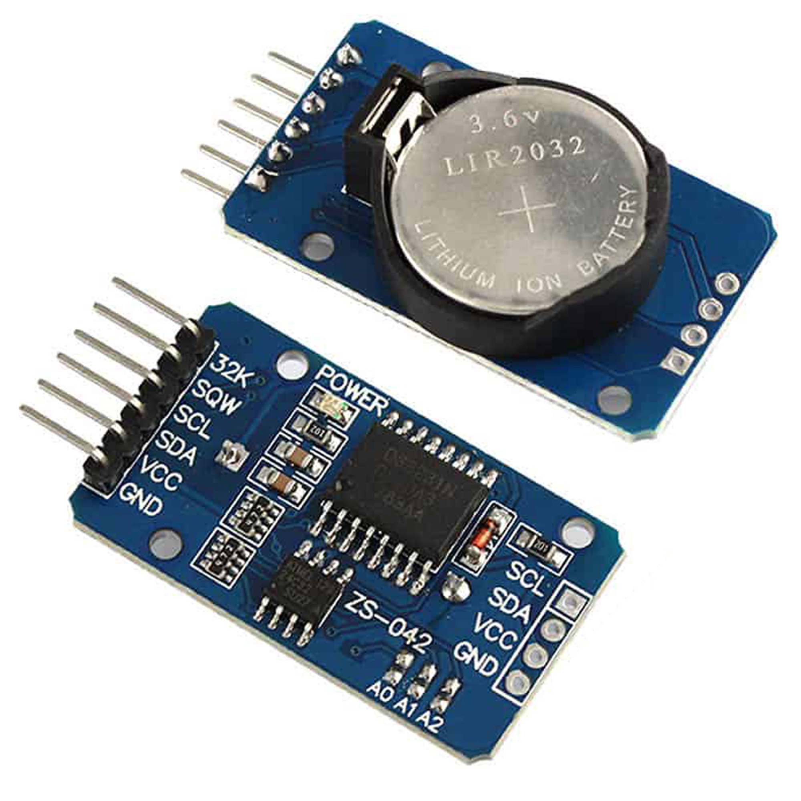](Image/image-5.png)
 - Module cảm biến ánh sáng  
 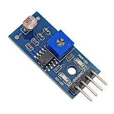](Image/image-6.png)
 - Màn hình LCD 1602 màn 16x2 xanh  
 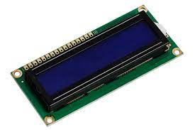](Image/image-7.png)
 - Màn hình OLED 0.96 inch  
 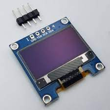](Image/image-8.png)
 - Cảm biến độ ẩm đất  
 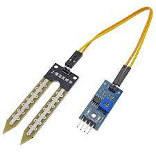](Image/image-9.png)
 - Dây nguồn chuyển đổi 220V - 12V 1A  
 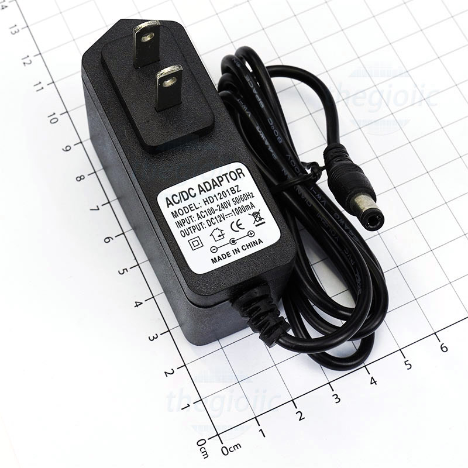](Image/image-10.png)
 - Đèn LED 12V dây  
 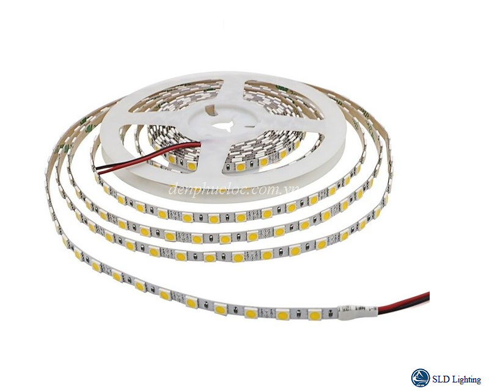](Image/image-11.png)
 - FTDI Programming Board  
 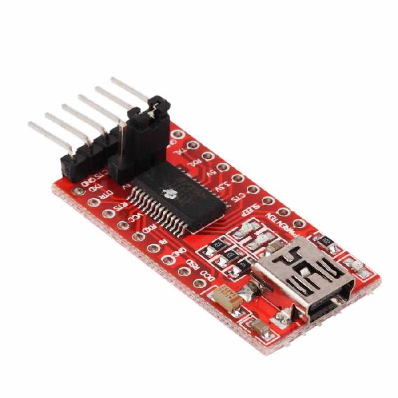](Image/image-12.png)
  
  __2. Quá trình lắp ráp__  
  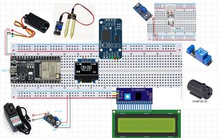
